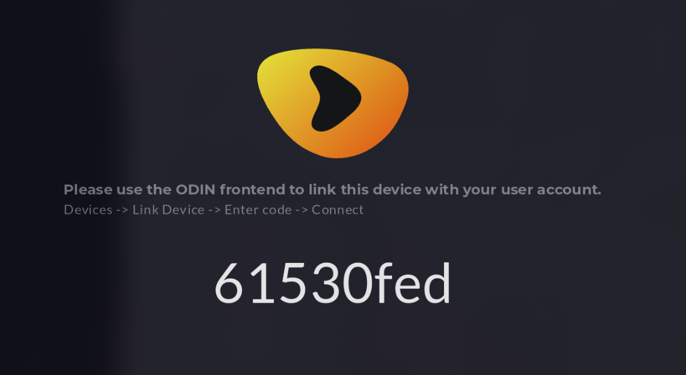

<h1 align="center">
 
</h1>

<h4 align="center">Android TV app for <a href="https://github.com/ad-on-is/odin-server">Odin</a></h4>

This is the Android TV app to enjoy Odin on your TV.

# Installation

- Install and setup the [Odin server](https://github.com/ad-on-is/odin-server) first
- Download the latest APK from the [release](https://github.com/ad-on-is/odin-tv/releases) page
- Sideload to your Android TV box
- Follow the on-screen instructions

## Compatible devices

- Xiaomi MiBox
- Amazon Fire TV Cube 2/3
- Other devices need testing and confirmation

> [!WARNING]
>
> The app does not come with a built-in video player. See below.

>

## Video Player

Odin TV **does not include a video player**, since there are better players out there that support audio-passthrough, etc, it is not worth the hassle to reinvent the wheel.

Recommended players:

- Just (default)
- Nova
- Kodi
- MX Player
- VLC

# Known issues

- The navigation is a bit wonky. This is due to Flutters lack of keyboard and D-Pad navigation. I'm working my ass of to make this as smooth as possible.
  - If you experience issues, just smash the buttons on your remote.

# Donations

## License

GPLv3

---

> GitHub [@ad-on-is](https://github.com/ad-on-is)
